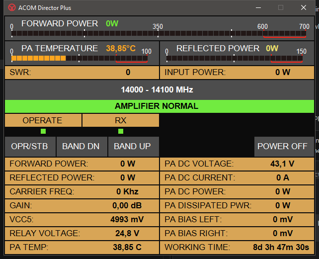

# ACOM-JTAlert-PWR

Fills JTAlert PWR Field with average TX PWR (Needs AutoHotkey and ACOM-Director-Plus).

This AutoHotkey v2 tool reads the Forward Power value displayed by ACOM Director Plus with OCR, averages the readings for a completed transmission session, and writes the result to the JTAlert PWR field.

## Tested configuration

The working test setup used:

- Windows desktop environment.
- AutoHotkey v2.0, with `#Requires AutoHotkey v2.0`.
- AutoHotkey executable: `C:\Program Files\AutoHotkey\v2\AutoHotkey.exe`.
- Optional compiler: `C:\Program Files\AutoHotkey\Compiler\Ahk2Exe.exe`.
- ACOM Director Plus process: `ACOM Director Plus.exe`.
- JTAlert V2 process: `JTAlertV2.exe`.
- Tesseract OCR 5.4.0.20240606 at `C:\Program Files\Tesseract-OCR\tesseract.exe`.
- PowerShell with `System.Drawing` and `System.Windows.Forms`.

The ACOM and JTAlert product versions were not pinned. The script depends on their executable names, the ACOM window layout, and the JTAlert control name below. Application updates or Windows display-scaling changes may require retesting.

## Files and installation

Keep these files together:

- `TX PWR ACOM to WSJTXLOG.ahk` - main AutoHotkey v2 script.
- `Read-ACOM-Power.ps1` - screenshot capture and Tesseract OCR helper.

1. Install AutoHotkey v2, ACOM Director Plus, JTAlert V2, and Tesseract OCR.
2. Copy both project files to one directory.
3. Start ACOM Director Plus and JTAlert V2.
4. Make sure the ACOM Forward Power display is visible and readable at least once.
5. Run `TX PWR ACOM to WSJTXLOG.ahk` with AutoHotkey v2.
6. Transmit and confirm that JTAlert's PWR field changes after the transmission ends.

The script uses OCR because the tested ACOM controls returned empty text values. It reads the displayed pixels instead.

## How it works

The AutoHotkey timer runs every second and starts an asynchronous PowerShell OCR job. The helper:

1. Captures a 305 x 23 pixel region from the ACOM window.
2. Uses the tested window-relative Forward Power position, approximately x=12, y=318.
3. Converts the image to black and white.
4. Crops the numeric area, scales it four times, and runs Tesseract.
5. Uses a numeric whitelist first and a general OCR fallback if needed.
6. Removes non-digits and atomically replaces the result file.

Values must contain one to three digits and must be no greater than 700 W. Empty, non-numeric, and out-of-range OCR results are rejected.

## Average calculation

The tested JTAlert workflow updates once per completed transmission session, not once per OCR reading.

- A session starts when a valid nonzero reading is received.
- Valid readings are collected while power is present.
- Zero, empty, and invalid readings are excluded.
- The session ends after 2 seconds without a valid nonzero reading.
- The output is the rounded arithmetic mean:

  `average = Round(sum of accepted readings / number of accepted readings)`

- The result must be between 1 and 700 W.
- JTAlert is not rewritten when the average is unchanged.
- A five-second quiet guard prevents an immediate stale reading from starting another session.

## JTAlert target

The confirmed output target is:

- Window: `ahk_exe JTAlertV2.exe`
- Control: `Edit18`

The script uses `ControlSetText` to write the average. If JTAlert changes its control layout or the PWR field is no longer `Edit18`, update `WritePowerToJTAlert()` and retest.

## WSJT-X status: not verified

The script contains an older WSJT-X Log QSO test path, but this path has **not been proven to work in the current script**. It is not part of the confirmed JTAlert workflow and should not be relied on for automatic logging.

The unverified code uses client coordinates x=132, y=138 for the WSJT-X Log QSO TX Power field, and `Ctrl+Alt+T` attempts to enter 50 W. These coordinates may depend on WSJT-X version, window size, theme, and Windows display scaling. No claim is made here that the automatic WSJT-X fallback successfully writes or preserves the value.

When Log QSO is open it may cover ACOM. The script avoids starting a new ACOM capture in that situation, but allows an OCR job already in progress to finish.

## Hotkeys and diagnostics

- `Ctrl+Alt+P` - run a manual ACOM OCR capture and show the result.
- `Ctrl+Alt+T` - attempt the unverified WSJT-X test entry of 50 W.
- `Ctrl+Alt+D` - dump accessible ACOM control values to `Desktop\ACOM-control-values.txt`.

Manual OCR creates these Desktop files:

- `ACOM-window-debug.png`
- `ACOM-power-raw-debug.png`
- `ACOM-power-ocr-debug.png`
- `ACOM-power-ocr-input.png`
- `ACOM-ocr-trace.txt`

Normal polling does not overwrite the debug images unless a manual diagnostic capture is requested.

## Troubleshooting

### JTAlert is not updated

Confirm that JTAlert is running as `JTAlertV2.exe` and that its PWR field is still `Edit18`. The update occurs after 2 seconds without a valid nonzero OCR reading, not during every reading.

### OCR returns an empty or incorrect value

Make the Forward Power digits visible, keep ACOM unminimized, and check that Windows display scaling has not changed. Use `Ctrl+Alt+P` and inspect the Desktop debug images. Confirm the Tesseract path shown above.

### ACOM is covered by another window

Automatic polling is intended to be non-disruptive and does not activate ACOM. For manual diagnostics, `Ctrl+Alt+P` activates ACOM and shows the capture position. Move overlapping windows while testing.

### The script does not start

Run it with AutoHotkey v2, not v1. Keep the `.ps1` helper beside the `.ahk` file and check `Desktop\ACOM-ocr-trace.txt` for `AHK loaded`.

## Safety and limitations

The confirmed workflow only reads the displayed ACOM Forward Power value and writes text to JTAlert. It does not control transmitter power, change radio settings, or initiate a transmission. OCR accuracy depends on the display, window layout, Windows scaling, and application versions.

## Which ACOM value is read?

ACOM Director Plus displays Forward Power in two places. The OCR helper reads the **lower detailed `FORWARD POWER` field** in the status table, highlighted in the image below. It does not read the upper bar-gauge value.

The tested capture rectangle starts at approximately window-relative x=12, y=318 and is 305 x 23 pixels wide. If the ACOM layout, window scaling, or display scaling changes, this rectangle may need adjustment in `Read-ACOM-Power.ps1` and the AHK capture coordinates.
